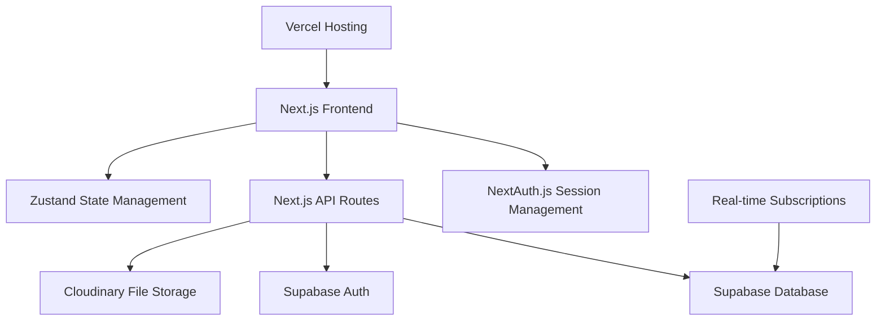

# Design Document

## Overview

This document outlines the technical design for the JOOKA e-commerce backend platform. The system will be built using Next.js 14 with App Router, Supabase for authentication and database management, NextAuth.js for session management, and Cloudinary for file storage. The platform will maintain the existing JOOKA brand aesthetic while providing comprehensive admin and customer functionality.

## Architecture

### High-Level Architecture



### Technology Stack

- **Frontend Framework**: Next.js 14 with App Router
- **Authentication**: Supabase Auth + NextAuth.js
- **Database**: Supabase PostgreSQL
- **File Storage**: Cloudinary
- **State Management**: Zustand (existing)
- **Styling**: Tailwind CSS (existing JOOKA theme)
- **UI Components**: Custom components following JOOKA style guide
- **Animations**: Framer Motion (existing)
- **Hosting**: Vercel
- **Real-time**: Supabase Realtime

## Components and Interfaces

### 1. Authentication System

#### Supabase Auth Configuration
```typescript
interface AuthConfig {
  providers: ['email', 'google', 'facebook']
  emailVerification: boolean
  passwordReset: boolean
  mfa?: boolean
}
```

#### NextAuth.js Integration
```typescript
interface SessionUser {
  id: string
  email: string
  role: 'admin' | 'customer'
  profile: UserProfile
}
```

### 2. Database Schema

#### Core Tables Structure

**Users Table**
```sql
users (
  id: uuid PRIMARY KEY,
  email: varchar UNIQUE,
  role: user_role DEFAULT 'customer',
  created_at: timestamp,
  updated_at: timestamp,
  profile_id: uuid REFERENCES profiles(id)
)
```

**Profiles Table**
```sql
profiles (
  id: uuid PRIMARY KEY,
  user_id: uuid REFERENCES users(id),
  first_name: varchar,
  last_name: varchar,
  phone: varchar,
  avatar_url: varchar,
  created_at: timestamp,
  updated_at: timestamp
)
```

**Products Table**
```sql
products (
  id: uuid PRIMARY KEY,
  name: varchar NOT NULL,
  description: text,
  price: decimal NOT NULL,
  category_id: uuid REFERENCES categories(id),
  inventory_count: integer DEFAULT 0,
  images: jsonb,
  status: product_status DEFAULT 'active',
  created_at: timestamp,
  updated_at: timestamp
)
```

**Orders Table**
```sql
orders (
  id: uuid PRIMARY KEY,
  user_id: uuid REFERENCES users(id),
  status: order_status DEFAULT 'pending',
  total_amount: decimal NOT NULL,
  shipping_address: jsonb,
  payment_method: jsonb,
  created_at: timestamp,
  updated_at: timestamp
)
```

**Order Items Table**
```sql
order_items (
  id: uuid PRIMARY KEY,
  order_id: uuid REFERENCES orders(id),
  product_id: uuid REFERENCES products(id),
  quantity: integer NOT NULL,
  unit_price: decimal NOT NULL,
  total_price: decimal NOT NULL
)
```

### 3. API Layer Design

#### RESTful API Structure
```
/api/auth/
  - POST /login
  - POST /register
  - POST /logout
  - POST /reset-password

/api/admin/
  - GET /dashboard
  - GET /users
  - GET /orders
  - POST /products
  - PUT /products/[id]
  - DELETE /products/[id]

/api/customer/
  - GET /profile
  - PUT /profile
  - GET /orders
  - POST /cart
  - POST /checkout

/api/products/
  - GET /
  - GET /[id]
  - GET /categories

/api/upload/
  - POST /image (Cloudinary integration)
```

### 4. File Storage Integration (Cloudinary)

#### Image Upload Service
```typescript
interface CloudinaryConfig {
  cloudName: string
  apiKey: string
  apiSecret: string
  uploadPreset: string
}

interface ImageUploadResponse {
  public_id: string
  secure_url: string
  width: number
  height: number
  format: string
}
```

#### Image Optimization Strategy
- Product images: Auto-optimize for web delivery
- User avatars: Circular crop with face detection
- Category images: Consistent aspect ratios
- Responsive images: Multiple sizes for different devices

### 5. UI/UX Design System

#### Dashboard Layouts

**Admin Dashboard**
- Sidebar navigation with JOOKA gold accents
- Dark theme (#111111 background) with gold (#D4AF37) highlights
- Data tables with sorting and filtering
- Modal dialogs for CRUD operations
- Real-time notifications panel

**Customer Dashboard**
- Clean, minimalist design following JOOKA style guide
- Card-based layout for order history
- Profile management with image upload
- Shopping cart with smooth animations
- Checkout flow with progress indicators

#### Component Library Extensions
```typescript
// Extend existing components for dashboard functionality
interface DashboardCard {
  title: string
  value: string | number
  trend?: 'up' | 'down' | 'neutral'
  icon: React.ComponentType
}

interface DataTable {
  columns: TableColumn[]
  data: any[]
  pagination: boolean
  sorting: boolean
  filtering: boolean
}
```

## Data Models

### 1. User Management Models

```typescript
interface User {
  id: string
  email: string
  role: 'admin' | 'customer'
  emailVerified: boolean
  createdAt: Date
  updatedAt: Date
  profile: UserProfile
}

interface UserProfile {
  id: string
  userId: string
  firstName: string
  lastName: string
  phone?: string
  avatarUrl?: string
  addresses: Address[]
  paymentMethods: PaymentMethod[]
}

interface Address {
  id: string
  type: 'shipping' | 'billing'
  street: string
  city: string
  state: string
  zipCode: string
  country: string
  isDefault: boolean
}
```

### 2. Product Management Models

```typescript
interface Product {
  id: string
  name: string
  description: string
  price: number
  categoryId: string
  category: Category
  inventoryCount: number
  images: ProductImage[]
  status: 'active' | 'inactive' | 'out_of_stock'
  createdAt: Date
  updatedAt: Date
}

interface ProductImage {
  id: string
  publicId: string
  secureUrl: string
  altText: string
  isPrimary: boolean
  order: number
}

interface Category {
  id: string
  name: string
  slug: string
  description?: string
  imageUrl?: string
  parentId?: string
  children?: Category[]
}
```

### 3. Order Management Models

```typescript
interface Order {
  id: string
  userId: string
  user: User
  status: 'pending' | 'processing' | 'shipped' | 'delivered' | 'cancelled'
  items: OrderItem[]
  totalAmount: number
  shippingAddress: Address
  paymentMethod: PaymentMethod
  paymentStatus: 'pending' | 'paid' | 'failed' | 'refunded'
  trackingNumber?: string
  createdAt: Date
  updatedAt: Date
}

interface OrderItem {
  id: string
  orderId: string
  productId: string
  product: Product
  quantity: number
  unitPrice: number
  totalPrice: number
}
```

## Error Handling

### 1. API Error Responses
```typescript
interface ApiError {
  code: string
  message: string
  details?: any
  timestamp: Date
}

// Standard error codes
enum ErrorCodes {
  UNAUTHORIZED = 'UNAUTHORIZED',
  FORBIDDEN = 'FORBIDDEN',
  NOT_FOUND = 'NOT_FOUND',
  VALIDATION_ERROR = 'VALIDATION_ERROR',
  INTERNAL_ERROR = 'INTERNAL_ERROR'
}
```

### 2. Client-Side Error Handling
- Global error boundary for React components
- Toast notifications for user-friendly error messages
- Retry mechanisms for failed API calls
- Offline state handling

### 3. Database Error Handling
- Supabase RLS (Row Level Security) policies
- Transaction rollback for failed operations
- Constraint violation handling
- Connection pool management

## Testing Strategy

### 1. Unit Testing
- API route handlers testing with Jest
- Component testing with React Testing Library
- Database model validation testing
- Utility function testing

### 2. Integration Testing
- Authentication flow testing
- Payment processing testing
- File upload testing with Cloudinary
- Real-time feature testing

### 3. End-to-End Testing
- User registration and login flows
- Complete purchase journey
- Admin dashboard functionality
- Mobile responsiveness testing

### 4. Security Testing
- SQL injection prevention testing
- XSS vulnerability testing
- Authentication bypass testing
- Authorization testing for different user roles

## Security Implementation

### 1. Authentication Security
- JWT token expiration and refresh
- Secure cookie configuration
- Rate limiting for auth endpoints
- Password strength requirements

### 2. Database Security
- Row Level Security (RLS) policies
- Prepared statements for SQL queries
- Input validation and sanitization
- Audit logging for sensitive operations

### 3. File Upload Security
- File type validation
- Size limitations
- Malware scanning integration
- Secure URL generation with Cloudinary

### 4. API Security
- CORS configuration
- Request validation middleware
- API rate limiting
- HTTPS enforcement

## Performance Optimization

### 1. Database Optimization
- Proper indexing strategy
- Query optimization
- Connection pooling
- Caching frequently accessed data

### 2. Image Optimization
- Cloudinary auto-optimization
- Responsive image delivery
- Lazy loading implementation
- WebP format support

### 3. Frontend Optimization
- Next.js App Router optimization
- Static generation where possible
- Code splitting and lazy loading
- Bundle size optimization

### 4. Real-time Features
- Efficient WebSocket connections
- Selective data subscriptions
- Connection state management
- Fallback for offline scenarios

## Deployment and Infrastructure

### 1. Vercel Configuration
- Environment variable management
- Build optimization settings
- Edge function deployment
- Custom domain configuration

### 2. Supabase Configuration
- Database connection pooling
- Backup and recovery setup
- Monitoring and alerting
- Performance tuning

### 3. Cloudinary Setup
- Upload preset configuration
- Transformation settings
- Webhook configuration for processing
- CDN optimization

### 4. Monitoring and Analytics
- Error tracking with Sentry
- Performance monitoring
- User analytics
- Business metrics tracking