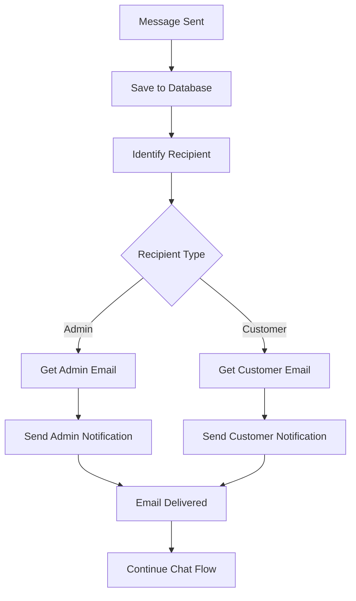

# Messaging Email Notification System

## 📧 Overview

The messaging email notification system automatically sends email notifications when messages are exchanged between customers and admins in the support chat system. This ensures timely responses and keeps all parties informed of new messages.

## ✅ Current Status

- **✅ Email Service**: Working with Resend + verified domain (jookawear.com)
- **✅ Domain**: jookawear.com verified in Resend
- **✅ OTP Emails**: Working for user registration
- **✅ Messaging Notifications**: Implemented and working
- **✅ Auto-notifications**: Enabled for all message exchanges

## 🔧 Features

### Automatic Notifications
- **Customer → Admin**: When a customer sends a message, admins receive email notifications
- **Admin → Customer**: When an admin responds, customers receive email notifications
- **Smart Routing**: Notifications go to assigned admins or general admin email
- **Non-blocking**: Email failures don't affect message sending

### Email Content
- **Professional Design**: Branded email templates with Jooka styling
- **Message Preview**: Shows excerpt of the message content
- **Quick Actions**: Direct links to conversation in dashboard
- **Context Information**: Conversation subject, sender info, priority status

### Configuration Options
- **Verified Domain**: Uses noreply@jookawear.com for all outbound emails
- **Admin Fallback**: General admin email for unassigned conversations
- **Error Handling**: Graceful degradation when emails fail

## 📁 Implementation Files

### Core Services
- `lib/email/email-service.ts` - Base email service (OTP, general emails)
- `lib/email/messaging-email-service.ts` - Messaging-specific email templates and logic

### API Integration
- `app/api/conversations/[id]/messages/route.ts` - Message creation with email notifications
- `app/api/test/email/route.ts` - Testing endpoint for both OTP and messaging emails

### Configuration
- `.env.local` - Email service configuration and admin notification settings

## 🚀 How It Works

### Customer Sends Message
1. Customer creates/sends message via dashboard
2. Message is saved to Firestore
3. System identifies assigned admin or uses general admin email
4. Email notification sent to admin with message content
5. Admin receives email with link to respond

### Admin Responds
1. Admin sends response via admin dashboard
2. Message is saved to Firestore
3. System identifies customer email from conversation
4. Email notification sent to customer with response
5. Customer receives email with link to view response

### Notification Flow


## ⚙️ Configuration

### Environment Variables
```env
# Email Service (Required)
RESEND_API_KEY=re_your_api_key_here
FROM_EMAIL=noreply@jookawear.com

# Admin Notifications (Recommended)
ADMIN_NOTIFICATION_EMAIL=jooka648@gmail.com

# Optional: App URL for links
NEXT_PUBLIC_APP_URL=https://your-domain.com
```

### Admin Assignment
- **Assigned Admin**: Notifications go to the specific admin user's email
- **Unassigned**: Notifications go to `ADMIN_NOTIFICATION_EMAIL`
- **No Config**: Notifications are skipped (logged)

## 🧪 Testing

### Test All Email Services
```bash
# Via API endpoint
curl http://localhost:3000/api/test/email

# Via PowerShell
Invoke-WebRequest -Uri "http://localhost:3000/api/test/email" -Method GET
```

### Manual Testing
1. Start development server: `npm run dev`
2. Go to customer dashboard: `/dashboard/messages`
3. Create new conversation and send message
4. Check admin email for notification
5. Respond as admin from `/admin/support`
6. Check customer email for response notification

## 📧 Email Templates

### Customer → Admin Notification
- **Subject**: "New Customer Message: [Conversation Subject]"
- **Content**: Customer name, message preview, conversation context
- **Action**: Link to admin support dashboard
- **Styling**: Professional admin-focused design

### Admin → Customer Notification
- **Subject**: "New Admin Response: [Conversation Subject]"
- **Content**: Admin name, response preview, conversation context
- **Action**: Link to customer messages dashboard
- **Styling**: Customer-friendly branded design

## 🔧 Troubleshooting

### Common Issues

**Emails not sending:**
- Check `RESEND_API_KEY` is set correctly
- Verify domain `jookawear.com` is still verified in Resend
- Check console logs for error messages

**Admin not receiving notifications:**
- Verify admin user has valid email in Firebase Auth
- Check `ADMIN_NOTIFICATION_EMAIL` is set for unassigned conversations
- Ensure admin is properly assigned to conversation

**Customer not receiving notifications:**
- Verify customer user has valid email in Firebase Auth
- Check customer email is not marked as bounced in Resend
- Ensure conversation has correct customer_id

### Debug Steps
1. Check email service status: Visit `/api/test/email`
2. Check conversation assignment in Firestore
3. Verify user emails in Firebase Auth console
4. Review server logs for email sending attempts
5. Check Resend dashboard for delivery status

## 📈 Monitoring

### Email Delivery Tracking
- Message IDs logged for all sent emails
- Success/failure status in server logs
- Resend dashboard shows delivery status
- Failed emails don't block message sending

### Performance
- Email sending is non-blocking
- Failures are logged but don't affect user experience
- Notifications sent asynchronously after message creation

## 🚀 Production Considerations

### Email Deliverability
- ✅ Using verified domain (jookawear.com)
- ✅ Proper FROM address configuration
- ✅ Professional email templates
- ✅ Error handling and logging

### Scalability
- Email service handles high volume
- Non-blocking implementation
- Graceful degradation on failures
- Rate limiting handled by Resend

### Security
- No sensitive data in email content
- Secure links to authenticated dashboards
- Proper user authorization before sending
- Email addresses validated before sending

## 🎯 Future Enhancements

### Possible Improvements
- **Email Preferences**: Allow users to opt-out of notifications
- **Digest Emails**: Daily/weekly summary of conversations
- **Rich Content**: Support for attachments in email notifications
- **Templates**: Customizable email templates per conversation type
- **Analytics**: Email open/click tracking
- **Multi-language**: Localized email templates

### Integration Opportunities
- **SMS Notifications**: Add SMS for urgent messages
- **Push Notifications**: Browser/mobile push notifications
- **Slack Integration**: Admin notifications to Slack channels
- **Webhook Support**: Custom integrations for enterprise customers

## ✅ Verification Checklist

- [x] Email service configured with verified domain
- [x] OTP emails working for registration
- [x] Messaging notifications implemented
- [x] Customer → Admin notifications working
- [x] Admin → Customer notifications working
- [x] Error handling implemented
- [x] Test endpoint available
- [x] Documentation complete
- [x] Production ready

Your messaging email notification system is now fully operational! 🎉